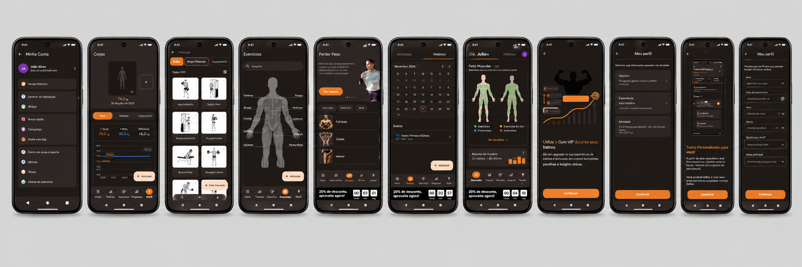
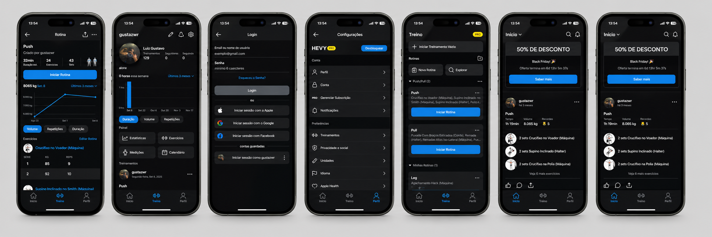
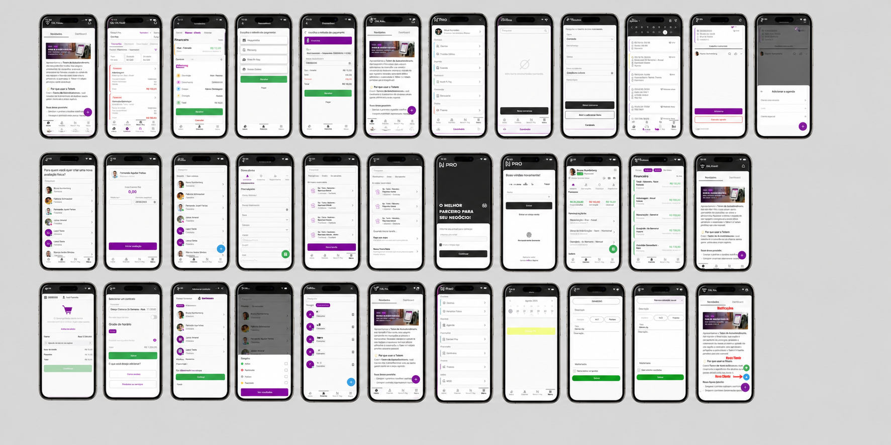
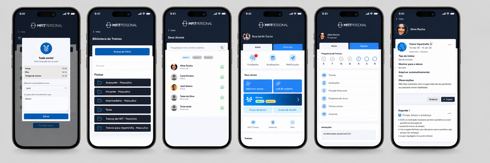

# Análise SWOT 

---
| 🟦 **FORÇAS** | 🟨 **OPORTUNIDADES** |
|---|---|
| • Busca rápida por aluno   • Histórico de treinos   • Informações centralizadas   • Interface simples   • Notificações automáticas   • Acessibilidade incluída | • Crescimento de apps fitness   • Treinos personalizados   • Integração com smartwatch   • Uso de vídeos explicativos   • Mercado de saúde em alta   • Gestão multiacademia   • Acessibilidade como diferencial |

| 🟥 **FRAQUEZAS** | 🟩 **AMEAÇAS** |
|---|---|
| • Dependência de internet   • Falta de gráficos intuitivos   • Poucos recursos avançados no início   • Resposta do personal pode atrasar   • Adaptação inicial dos usuários   • Acessibilidade incompleta no começo | • Concorrência de outros apps   • Problemas de conexão   • Baixo engajamento dos alunos   • Dificuldade tecnológica de usuários   • Dependência do personal trainer   • Preferência pelo WhatsApp |

##  Resumo SWOT

- **Forças:** Recursos internos positivos do sistema.  
- **Fraquezas:** Limitações que precisam melhorar.  
- **Oportunidades:** Tendências e chances de crescimento.  
- **Ameaças:** Fatores externos que podem prejudicar.  
---
# Exploração do Mercado – Identificação Visual de Soluções Existentes

Nesta etapa, foram analisadas soluções já existentes no mercado que possuem relação com a proposta do nosso sistema de gerenciamento de academia. O objetivo foi observar funcionalidades, público-alvo, organização visual e recursos que possam servir de referência para o desenvolvimento do projeto.

---

# Gym WP

**Público-alvo:** praticantes de musculação, academias e personal trainers.  

**Funcionalidade principal:** criação, organização e acompanhamento de treinos personalizados.  

**Descrição:** O Gym WP é um aplicativo bastante utilizado por pessoas interessadas em musculação e vida fitness. Ele funciona como um treinador pessoal no celular, permitindo montar treinos sob medida para diferentes objetivos, registrar cargas, acompanhar evolução e acessar uma grande variedade de exercícios explicados.  

**O que inspirou no projeto:** histórico de treinos, organização das fichas e acompanhamento de progresso.

---

# Hevy

**Público-alvo:** usuários de academia e praticantes de musculação.  

**Funcionalidade principal:** registro rápido de treinos e monitoramento de desempenho.  

**Descrição:** O Hevy destaca-se pela simplicidade e eficiência. Ele funciona como um caderno de treino digital, onde o usuário registra séries, repetições e pesos, além de acompanhar estatísticas e recordes pessoais. Também possui recursos sociais para compartilhar treinos e interagir com outros usuários.  

**O que inspirou no projeto:** interface simples, rapidez no uso e visualização clara de desempenho.

---

# NextFit

**Público-alvo:** academias, estúdios, boxes e alunos.  

**Funcionalidade principal:** integração entre gestão da academia e experiência do aluno.  

**Descrição:** O NextFit App conecta alunos e academias em uma única plataforma. O usuário pode acessar treinos, acompanhar evolução física, agendar aulas, visualizar contratos e realizar pagamentos. É uma solução mais voltada para gestão completa do negócio fitness.  

**O que inspirou no projeto:** integração entre aluno e academia, área administrativa e controle centralizado.

---

# MFIT Personal

**Público-alvo:** personal trainers, educadores físicos e alunos.  

**Funcionalidade principal:** gestão de alunos, prescrição de treinos e acompanhamento individual.  

**Descrição:** O MFIT Personal é voltado para profissionais de educação física que desejam organizar treinos, avaliações e comunicação com seus alunos. O sistema facilita o atendimento personalizado e melhora a relação entre treinador e cliente.  

**O que inspirou no projeto:** gestão de alunos, acompanhamento individual e praticidade para o personal trainer.

---

# Quadro Comparativo de Soluções Existente

| Critérios / Soluções | Solução A (GYM WP) | Solução B (Hevy) | Solução C (NEXTFIT APP) | Solução D (MFIT Personal) | Nossa Solução |
|---|---|---|---|---|---|
| Modelo de Negócio | SaaS (Assinatura mensal/anual) | Freemium (Premium p/ estatísticas) | B2B (Foco em donos de academia) | B2B (Foco em personal trainers) | Freemium + SaaS (Assinatura mensal/anual) |
| Tecnologia Utilizada | Web / Mobile (App) | Mobile (Foco em iOS/Android) | Web (Gestão) + Mobile (Aluno) | Web (Dashboard) + Mobile | Web/Mobile (App) |
| Público-Alvo | Academias de médio porte | Praticantes de musculação | Donos/Gestores de academias | Personal Trainers e Consultores | Personal trainers e Alunos |
| Pontos Fortes | Integração total com gestão | Comunidade, rastreio de treinos | Gestão financeira e automação | Facilidade para o personal | Controle de alunos, treinos e comunicação |
| Pontos Fracos / Limitações | Interface pode ser complexa | Focado em uso individual | Custo elevado para pequenos | Focado na marca do personal | Dependência de internet |

---
