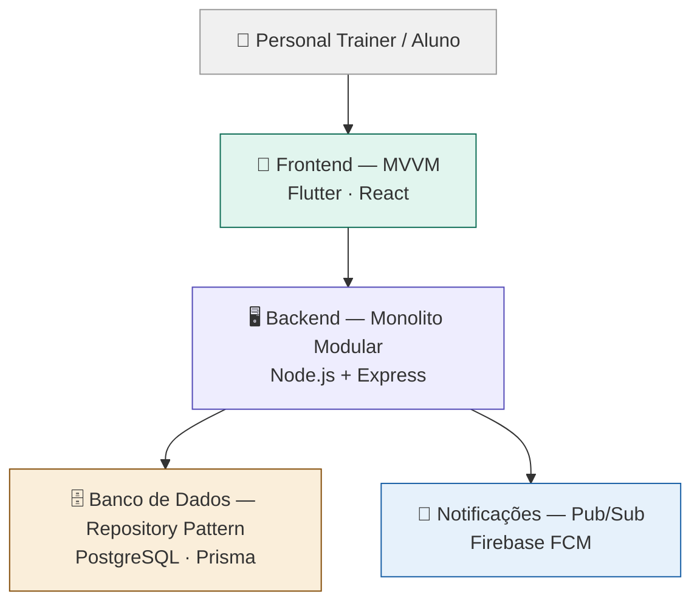
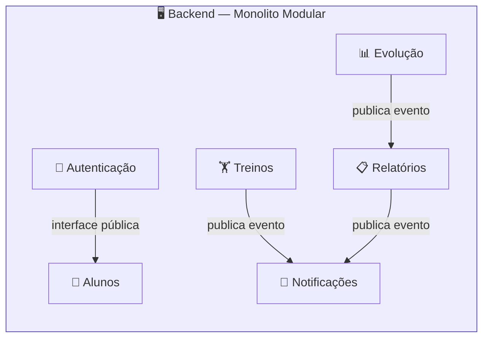
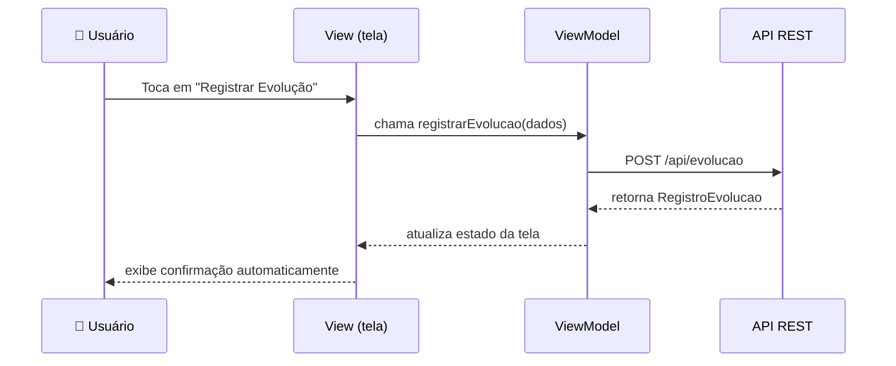
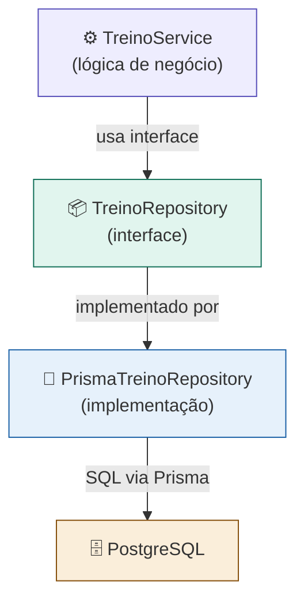
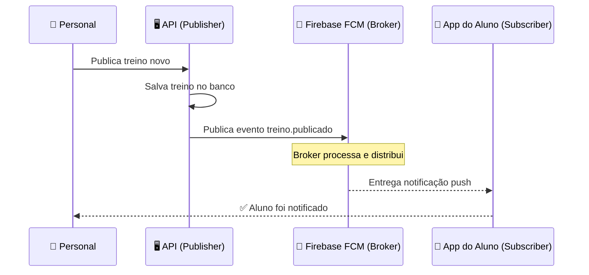
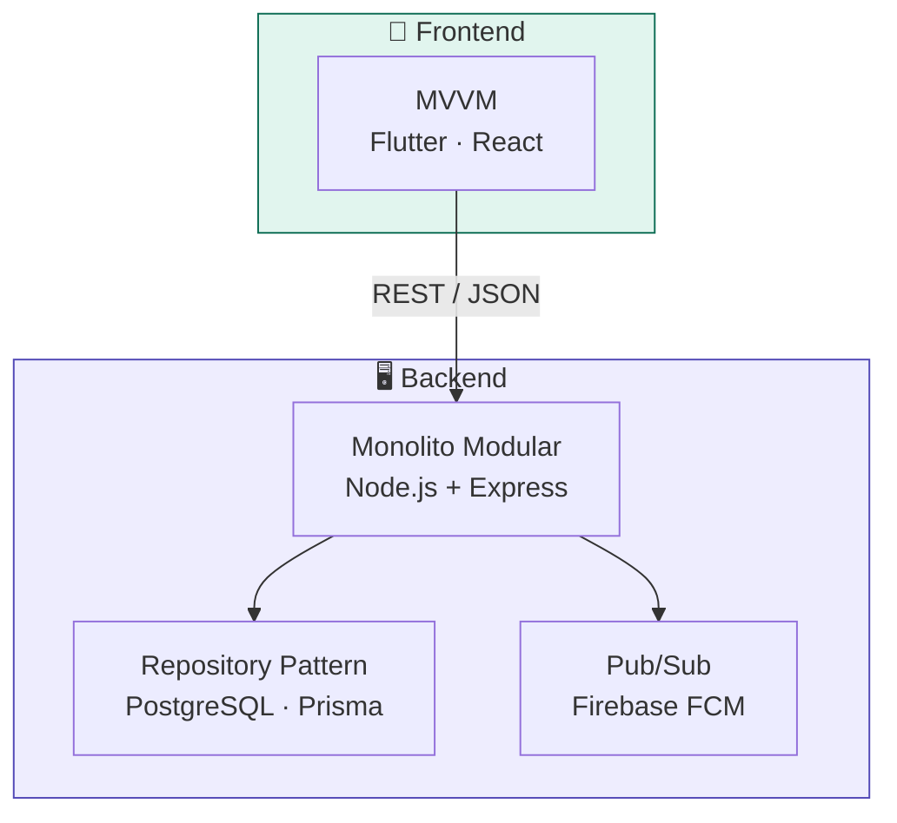

# 🏗️ Padrões Arquiteturais — TrainerX64
---

## 📋 Sumário

| # | Padrão | Camada de atuação |
|---|--------|-------------------|
| 1 | [Monolito Modular](#1-monolito-modular) | Estrutura geral do backend |
| 2 | [MVVM — Model-View-ViewModel](#2-mvvm--model-view-viewmodel) | Interface (frontend) |
| 3 | [Repository Pattern](#3-repository-pattern) | Acesso a dados |
| 4 | [Pub/Sub — Publisher/Subscriber](#4-pubsub--publishersubscriber) | Comunicação assíncrona e notificações |

---

## 🗺️ Visão Geral da Arquitetura

O TrainerX64 combina **quatro padrões arquiteturais complementares**, cada um atuando em uma camada distinta do sistema. A escolha foi guiada pelos seguintes princípios:

- **Coerência com o domínio:** os padrões foram selecionados a partir das funcionalidades reais do backlog
- **Adequação ao tamanho do projeto:** evitando complexidade desnecessária (ex: microserviços)
- **Testabilidade:** cada padrão favorece a separação de responsabilidades e testes independentes
- **Escalabilidade futura:** a estrutura permite crescimento incremental sem refatoração total



> **Figura 1 — Mapa geral dos padrões arquiteturais do TrainerX64.**
> Cada padrão atua em uma camada distinta sem sobreposição de responsabilidades.
> *Fonte: elaborado pelos autores.*

---

## 1. Monolito Modular

### 1.1 📖 Descrição do Padrão

O **Monolito Modular** é um estilo arquitetural no qual o sistema é desenvolvido e implantado como uma **única unidade de software**, mas organizado internamente em **módulos independentes** por domínio de negócio.

Diferente de um monolito tradicional — onde todo o código é misturado sem fronteiras claras —, o Monolito Modular impõe **separação explícita de responsabilidades**: cada módulo representa um domínio funcional e expõe apenas uma interface controlada para comunicação com os demais.

> ⚠️ **Regra fundamental:** nenhum módulo acessa diretamente o código interno de outro.
> Toda comunicação ocorre exclusivamente pelas **interfaces públicas** de cada módulo.

**Comparativo entre estilos arquiteturais:**

| Característica | Monolito Tradicional | Monolito Modular | Microserviços |
|---|:---:|:---:|:---:|
| Deploy único | ✅ | ✅ | ❌ |
| Fronteiras entre domínios | ❌ | ✅ | ✅ |
| Complexidade operacional | 🟢 Baixa | 🟢 Baixa | 🔴 Alta |
| Escalabilidade independente | ❌ | ❌ | ✅ |
| Adequado para times pequenos | ✅ | ✅ | ❌ |
| Evolução para microserviços | ❌ | ✅ | — |

### 1.2 ✅ Justificativa da Escolha

O TrainerX64 possui domínios funcionais claramente distintos — **treinos, alunos, evolução física, relatórios e notificações** — o que torna benéfica a separação modular interna. Ao mesmo tempo, o sistema **não justifica** a complexidade operacional de microserviços: a equipe é pequena, o escopo é bem delimitado e não há requisito de escala independente por serviço nesta etapa.

**Problemas que o Monolito Modular resolve no TrainerX64:**

- ✅ Evita o caos de um monolito sem organização interna
- ✅ Não exige infraestrutura pesada (Kubernetes, API Gateway, service mesh)
- ✅ Permite que cada membro da equipe trabalhe em módulos distintos sem conflito
- ✅ Serve como **base de evolução natural para microserviços** no futuro, se o sistema crescer
- ✅ Facilita a rastreabilidade entre histórias de usuário e módulos do sistema

### 1.3 🔧 Aplicação no Sistema

O backend do TrainerX64 é organizado nos seguintes módulos internos:

```
backend/
├── 📁 modulo-autenticacao/   → Login, registro, permissões e controle de sessão
├── 📁 modulo-alunos/         → Cadastro e gerenciamento de alunos vinculados ao personal
├── 📁 modulo-treinos/        → Criação, edição, publicação e histórico de treinos
├── 📁 modulo-evolucao/       → Registro de medições e cálculo de progresso físico
├── 📁 modulo-relatorios/     → Geração automática de relatórios por aluno e período
└── 📁 modulo-notificacoes/   → Disparo de alertas e integração com Firebase FCM
```



> **Figura 2 — Estrutura interna do Monolito Modular do TrainerX64.**
> Os módulos se comunicam apenas por interfaces públicas, sem acesso direto ao código interno uns dos outros.
> *Fonte: elaborado pelos autores.*

---

## 2. MVVM — Model-View-ViewModel

### 2.1 📖 Descrição do Padrão

O **MVVM (Model-View-ViewModel)** é um padrão arquitetural voltado para a **camada de interface do usuário**. Ele divide a interface em três componentes com responsabilidades bem definidas:

| Componente | Responsabilidade | Exemplo no TrainerX64 |
|---|---|---|
| **Model** | Dados e entidades do domínio | `Treino`, `Aluno`, `RegistroEvolucao` |
| **View** | Interface visual — sem lógica de negócio | Tela de treinos, tela de evolução |
| **ViewModel** | Estado da tela e processamento de ações | `TreinoViewModel`, `EvolucaoViewModel` |

O mecanismo central do MVVM é o **data binding reativo**: quando os dados no ViewModel mudam, a View se atualiza automaticamente — sem comandos manuais do desenvolvedor.

```
┌───────────────────────────────────────────────────┐
│                      MVVM                         │
│                                                   │
│  ┌──────────┐   observa    ┌─────────────────┐    │
│  │   View   │◄─────────────│   ViewModel     │    │
│  │  (tela)  │              │  (lógica de UI) │    │
│  └──────────┘              └────────┬────────┘    │
│       │                            │              │
│    ações                         chama            │
│       │                            ▼              │
│       └──────────────────► ┌──────────────┐       │
│                            │    Model     │       │
│                            │   (dados)    │       │
│                            └──────────────┘       │
└───────────────────────────────────────────────────┘
```

### 2.2 ✅ Justificativa da Escolha

O TrainerX64 será desenvolvido com **Flutter** (mobile) e **React.js** (web). Ambos os frameworks foram construídos sobre o conceito de **estado reativo** — quando um dado muda, a interface é reconstruída automaticamente.

> 💡 O MVVM já está presente por natureza nesses frameworks.
> Declará-lo como padrão é **reconhecer e documentar** o que o Flutter e o React já fazem por design.

**Por que não MVC no frontend?**
O MVC foi criado para servidores que montam páginas HTML e devolvem ao navegador. O MVVM foi criado para **interfaces reativas** — que é exatamente o modelo do Flutter e do React. Aplicar MVC no frontend seria contrariar a arquitetura natural dos frameworks escolhidos.

### 2.3 🔧 Aplicação no Sistema



> **Figura 3 — Fluxo MVVM para registro de evolução física no TrainerX64.**
> A View não contém lógica — ela apenas observa o ViewModel e se atualiza automaticamente.
> *Fonte: elaborado pelos autores.*

**ViewModels definidos no sistema:**

| ViewModel | Tela correspondente | Responsabilidade principal |
|---|---|---|
| `AuthViewModel` | Login / Registro | Controla autenticação e sessão |
| `AlunoViewModel` | Lista de alunos | Filtragem, busca e navegação |
| `TreinoViewModel` | Criação e edição de treino | Validação e envio do treino |
| `EvolucaoViewModel` | Registro de evolução | Coleta e envio de medições |
| `RelatorioViewModel` | Visualização de relatório | Carregamento e formatação de dados |
| `NotificacaoViewModel` | Central de notificações | Listagem e marcação como lida |

---

## 3. Repository Pattern

### 3.1 📖 Descrição do Padrão

O **Repository Pattern** cria uma **camada de abstração** entre a lógica de negócio e o mecanismo de acesso a dados. Em vez de o código de negócio realizar chamadas diretas ao banco de dados, ele interage com um **repositório** — uma interface que expõe operações padronizadas de leitura e escrita, sem expor os detalhes de implementação do banco.

```
┌────────────────────────────────────────────────────┐
│             Camada de Negócio (Services)           │
└────────────────────────┬───────────────────────────┘
                         │  usa interface
                         ▼
┌────────────────────────────────────────────────────┐
│           Repository Interface                     │
│   buscar() · salvar() · atualizar() · remover()    │
└────────────────────────┬───────────────────────────┘
                         │  implementado por
                         ▼
┌────────────────────────────────────────────────────┐
│         Implementação Concreta (Prisma ORM)        │
│                   PostgreSQL                       │
└────────────────────────────────────────────────────┘
```

### 3.2 ✅ Justificativa da Escolha

Sem o Repository Pattern, a lógica de acesso ao banco ficaria **dispersa por todo o código**, gerando:

- ❌ Duplicação de consultas em diferentes partes do sistema
- ❌ Dificuldade de trocar o banco de dados sem reescrever o sistema
- ❌ Impossibilidade de testar a lógica de negócio sem depender do banco real

**Com o Repository Pattern:**

- ✅ Cada entidade tem um único lugar responsável pelas operações de banco
- ✅ A lógica de negócio não sabe — nem precisa saber — como os dados são armazenados
- ✅ Os repositórios podem ser substituídos por **mocks** durante os testes automatizados
- ✅ A troca de banco de dados no futuro afeta apenas a implementação dos repositórios

### 3.3 🔧 Aplicação no Sistema

O TrainerX64 define um repositório para cada entidade principal do domínio:

| Repositório | Operações principais |
|---|---|
| `AlunoRepository` | `buscarPorId` · `listarPorPersonal` · `cadastrar` · `atualizar` · `remover` |
| `TreinoRepository` | `buscarPorAluno` · `listarHistorico` · `salvar` · `editar` · `arquivar` |
| `EvolucaoRepository` | `registrarMedicao` · `buscarHistorico` · `calcularProgresso` |
| `RelatorioRepository` | `gerarPorAluno` · `gerarPorPeriodo` · `buscarUltimo` |
| `NotificacaoRepository` | `registrar` · `marcarComoLida` · `listarPendentes` |



> **Figura 4 — Repository Pattern aplicado ao módulo de Treinos do TrainerX64.**
> O Service conhece apenas a interface do repositório — nunca a implementação concreta ou o banco de dados.
> *Fonte: elaborado pelos autores.*

---

## 4. Pub/Sub — Publisher/Subscriber

### 4.1 📖 Descrição do Padrão

O **Pub/Sub (Publisher/Subscriber)** é um padrão de **comunicação assíncrona baseada em eventos**. Os componentes do sistema não se comunicam diretamente — em vez disso:

- **Publisher (publicador):** dispara um evento quando algo relevante acontece. Não sabe quem vai receber.
- **Canal (broker):** recebe o evento e o distribui para todos os assinantes registrados.
- **Subscriber (assinante):** está inscrito no canal e reage automaticamente quando o evento chega.

```
  Publisher ──► [ Canal / Broker ]──► Subscriber A
                       │
                       ├──────────► Subscriber B
                       │
                       └──────────► Subscriber C
```

> 💡 O desacoplamento é total: quem publica não conhece quem assina, e quem assina não conhece quem publica.

### 4.2 ✅ Justificativa da Escolha

O TrainerX64 possui funcionalidades que dependem de **comunicação assíncrona por natureza**:

| Funcionalidade do backlog | Por que precisa de Pub/Sub |
|---|---|
| Notificações automáticas | O sistema não pode travar esperando a notificação ser entregue |
| Relatórios automáticos | A geração deve ocorrer em segundo plano após um evento |
| Comunicação personal → aluno | Mensagens devem ser entregues sem bloquear outras operações |

O **Firebase Cloud Messaging (FCM)** já implementa o padrão Pub/Sub nativamente para notificações push, tornando a escolha tecnicamente direta. A rastreabilidade com o backlog é imediata — as funcionalidades de _"notificações automáticas"_ e _"relatórios automáticos"_ listadas no TP1 **não seriam viáveis** sem esse padrão.

### 4.3 🔧 Aplicação no Sistema



> **Figura 5 — Fluxo Pub/Sub para publicação de treino no TrainerX64.**
> O personal publica o treino, a API dispara o evento e o FCM entrega a notificação de forma assíncrona.
> *Fonte: elaborado pelos autores.*

**Eventos definidos no sistema:**

| Evento | Publisher | Subscriber | Ação resultante |
|---|---|---|---|
| `treino.publicado` | Módulo de Treinos | Módulo de Notificações | Notificação push para o aluno |
| `evolucao.registrada` | Módulo de Evolução | Módulo de Relatórios | Atualização automática do relatório |
| `mensagem.enviada` | Módulo de Comunicação | Módulo de Notificações | Notificação push de nova mensagem |
| `relatorio.gerado` | Módulo de Relatórios | Módulo de Notificações | Notificação de relatório disponível |

---

## 📊 Resumo das Decisões Arquiteturais



| Padrão | Camada | Problema que resolve |
|---|---|---|
| **Monolito Modular** | Backend — estrutura geral | Organização por domínio sem complexidade de microserviços |
| **MVVM** | Frontend — interface | Interface reativa e testável no Flutter e React |
| **Repository Pattern** | Backend — acesso a dados | Operações de banco centralizadas e desacopladas |
| **Pub/Sub** | Backend — eventos | Comunicação assíncrona para notificações e relatórios |

---

## 📚 Referências

- MARTIN, Robert C. *Clean Architecture: A Craftsman's Guide to Software Structure and Design*. Prentice Hall, 2017.
- FOWLER, Martin. *Patterns of Enterprise Application Architecture*. Addison-Wesley, 2002.
- RICHARDS, Mark. *Software Architecture Patterns*. O'Reilly Media, 2015.
- Firebase Documentation. *Firebase Cloud Messaging*. Google, 2024. Disponível em: [https://firebase.google.com/docs/cloud-messaging](https://firebase.google.com/docs/cloud-messaging)

---

<div align="center">

*Documento elaborado para o Trabalho Prático II — Engenharia de Software I — ICET/UFAM*

</div>
