# 🗺️ Rastreabilidade — Histórias × Telas — TrainerX64
---

##  Sumário

| Código | Tela | Perfil | Histórias vinculadas |
|---|---|:---:|---|
| [T01](#t01--criar-conta-etapa-1) | Criar Conta — Etapa 1 | Geral | H28 |
| [T02](#t02--criar-conta-etapa-2--seu-perfil) | Criar Conta — Etapa 2 / Seu Perfil | Geral | H07, H16, H17 |
| [T03](#t03--login--personal-trainer) | Login — Personal Trainer | PT | H28, H29 |
| [T04](#t04--login--aluno) | Login — Aluno | A / AA | H28, H29 |
| [T05](#t05--dashboard-do-personal-trainer) | Dashboard do Personal Trainer | PT | H02, H06, H09, H12 |
| [T06](#t06--dashboard-do-aluno) | Dashboard do Aluno | A | H24, H25, H22 |
| [T07](#t07--progresso-do-aluno) | Progresso do Aluno | A / AA | H13, H23, H22 |
| [T08](#t08--notificações) | Notificações | A / PT | H09, H12, H25 |
| [T09](#t09--perfil-do-aluno) | Perfil do Aluno | A / AA | H17 |
| [T10](#t10--chat-integrado) | Chat Integrado | A / PT | H05 |
| [T11](#t11--treinos-do-aluno) | Treinos do Aluno | A | H24, H10, H11 |
| [T12](#t12--perfil--alto-contraste-ativado) | Perfil — Alto Contraste Ativado | AA | H17, H16 |
| [T13](#t13--meus-alunos) | Meus Alunos | PT | H06, H21, H26, H27 |
| [T14](#t14--treinos-do-personal-trainer) | Treinos do Personal Trainer | PT | H01, H03 |
| [T15](#t15--criar-treino) | Criar Treino | PT | H01, H21 |

---

## Convenção de leitura

Cada tela contém:

- **Print da tela** — imagem do MVP implementado
- **Histórias vinculadas** — número, enunciado e como foi implementada

```
Tela → Print → História de Usuário → Implementação no MVP
```

---

<a id="t01--criar-conta-etapa-1"></a>
## T01 — Criar Conta: Etapa 1

> **Perfil:** Geral · **Cor predominante:** Azul/Verde
> **Descrição:** Tela inicial do fluxo de cadastro. Coleta nome completo, e-mail, senha e confirmação de senha. Apresenta logo, barra de progresso `1/2` e botão `Continuar`.

###  Print da tela
> 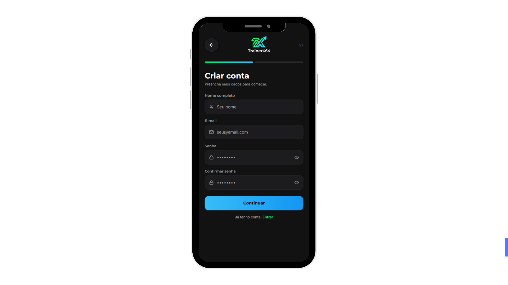


---

### Histórias vinculadas

#### H28 — Login com e-mail e senha

> *Como personal ou aluno, desejo me autenticar com e-mail e senha para acessar o sistema com segurança.*

**Implementação no MVP:**
A tela T01 inicia o fluxo de criação de conta com os campos de e-mail e senha, que são os mesmos utilizados na autenticação futura. A validação de campos obrigatórios, mensagens de feedback e a estrutura de senha com confirmação atendem diretamente aos critérios de autenticação definidos em H28.

<p align="right"><a href="#-sumário">⬆️ Voltar ao sumário</a></p>

---

<a id="t02--criar-conta-etapa-2--seu-perfil"></a>
## T02 — Criar Conta: Etapa 2 / Seu Perfil

> **Perfil:** Geral · **Cor predominante:** Azul/Verde
> **Descrição:** Segunda etapa do cadastro. Seleção de tipo de conta (Personal ou Aluno), objetivo principal, recursos de acessibilidade e aceite dos Termos de Uso e Política de Privacidade.

###  Print da tela

> 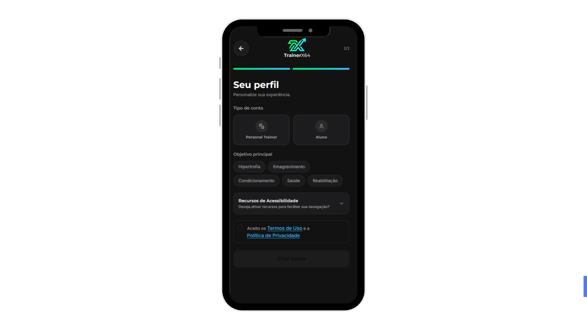

---

### Histórias vinculadas

#### H07 — Fluxo de primeiros passos

> *Como personal ou aluno, desejo ser guiado em um fluxo de configuração inicial ao criar minha conta, para configurar o sistema conforme meu perfil e objetivos.*

**Implementação no MVP:**
A tela T02 representa o fluxo de primeiros passos: seleção de perfil (Personal ou Aluno), definição de objetivo principal (Hipertrofia, Emagrecimento, Condicionamento, Saúde, Reabilitação) e aceite dos termos. A progressão `2/2` comunica ao usuário onde ele está no fluxo.

---

#### H16 — Suporte a leitores de tela

> *Como aluno com acessibilidade, desejo que o aplicativo seja compatível com leitores de tela, para navegar e interagir com autonomia.*

**Implementação no MVP:**
A tela T02 apresenta um card expansível de Recursos de Acessibilidade diretamente no cadastro, permitindo que o usuário com necessidades especiais configure preferências antes mesmo de acessar o sistema pela primeira vez.

---

#### H17 — Alto contraste e fontes escaláveis

> *Como aluno com acessibilidade, desejo ativar alto contraste e ajustar o tamanho das fontes, para melhorar minha legibilidade dentro do aplicativo.*

**Implementação no MVP:**
O card de Recursos de Acessibilidade disponível em T02 inclui as opções de alto contraste e texto ampliado como configurações iniciais, posicionando essas preferências como parte integrante da experiência desde o onboarding.

<p align="right"><a href="#-sumário">⬆️ Voltar ao sumário</a></p>

---

<a id="t03--login--personal-trainer"></a>
## T03 — Login — Personal Trainer

> **Perfil:** Personal Trainer · **Cor predominante:** Azul/Ciano
> **Descrição:** Tela de login com o perfil Personal ativo. Logo, cards de seleção de perfil, campos de e-mail e senha, link de recuperação e botão de entrada. Card Personal destacado em azul/ciano.

###  Print da tela

> 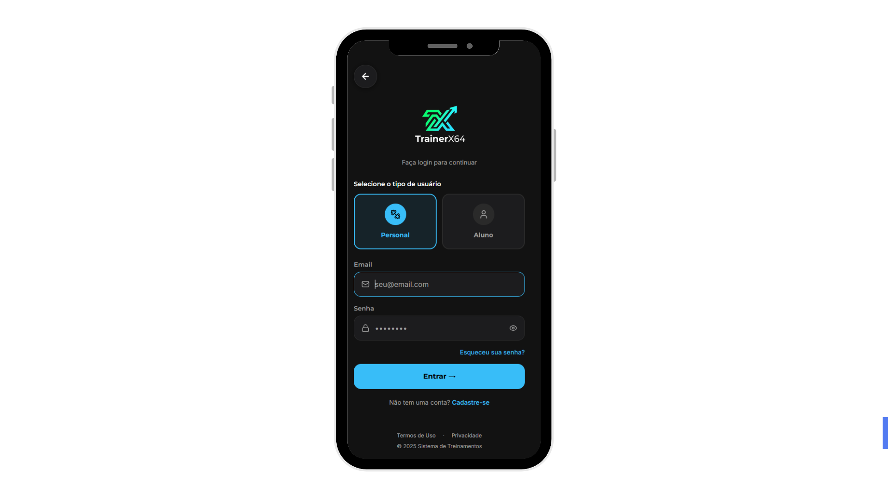

---

### Histórias vinculadas

#### H28 — Login com e-mail e senha

> *Como personal ou aluno, desejo me autenticar com e-mail e senha para acessar o sistema com segurança.*

**Implementação no MVP:**
A tela T03 implementa a autenticação completa para o perfil Personal: campos de e-mail e senha, botão de visualizar senha, mensagens de erro para credenciais inválidas e mensagem de sucesso ao acessar. A logo do TrainerX64 é exibida conforme exigência do TP4.

---

#### H29 — Recuperação de senha por e-mail

> *Como personal ou aluno, desejo recuperar minha senha por e-mail caso eu a esqueça, para retomar o acesso ao sistema sem perder meus dados.*

**Implementação no MVP:**
O link `Esqueceu sua senha?` presente em T03 dá acesso ao fluxo de recuperação de senha, atendendo ao critério de acesso ao recurso diretamente na tela de login.

<p align="right"><a href="#-sumário">⬆️ Voltar ao sumário</a></p>

---

<a id="t04--login--aluno"></a>
## T04 — Login — Aluno

> **Perfil:** Aluno · **Cor predominante:** Verde
> **Descrição:** Tela de login com o perfil Aluno ativo. Estrutura idêntica à T03, com destaque visual em verde. Mesmos elementos funcionais, diferenciados pela cor do perfil selecionado.

###  Print da tela
> 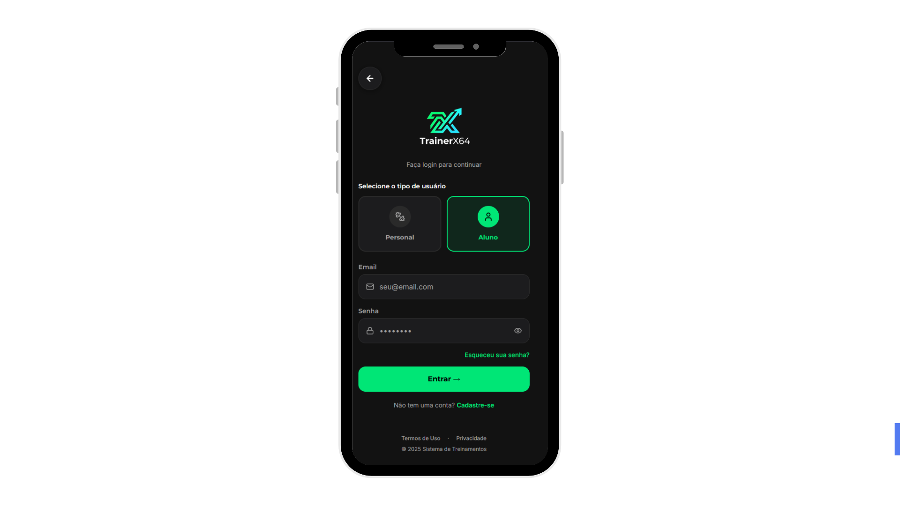

---

### Histórias vinculadas

#### H28 — Login com e-mail e senha

> *Como personal ou aluno, desejo me autenticar com e-mail e senha para acessar o sistema com segurança.*

**Implementação no MVP:**
A tela T04 implementa a autenticação para o perfil Aluno com os mesmos critérios funcionais de H28: validação de campos, mensagens de erro e sucesso, e exibição da logo do TrainerX64. A diferenciação visual em verde reforça a separação de perfis dentro do mesmo fluxo de autenticação.

---

#### H29 — Recuperação de senha por e-mail

> *Como personal ou aluno, desejo recuperar minha senha por e-mail caso eu a esqueça, para retomar o acesso ao sistema sem perder meus dados.*

**Implementação no MVP:**
O link `Esqueceu sua senha?` presente em T04 garante que o fluxo de recuperação esteja acessível para ambos os perfis diretamente na tela de login.

<p align="right"><a href="#-sumário">⬆️ Voltar ao sumário</a></p>

---

<a id="t05--dashboard-do-personal-trainer"></a>
## T05 — Dashboard do Personal Trainer

> **Perfil:** Personal Trainer · **Cor predominante:** Azul/Ciano
> **Descrição:** Tela inicial interna do Personal. Saudação personalizada, indicadores gerais (alunos ativos, treinos pendentes, avaliações), gráfico de volume semanal, ações rápidas e lista de alunos recentes.

###  Print da tela

> 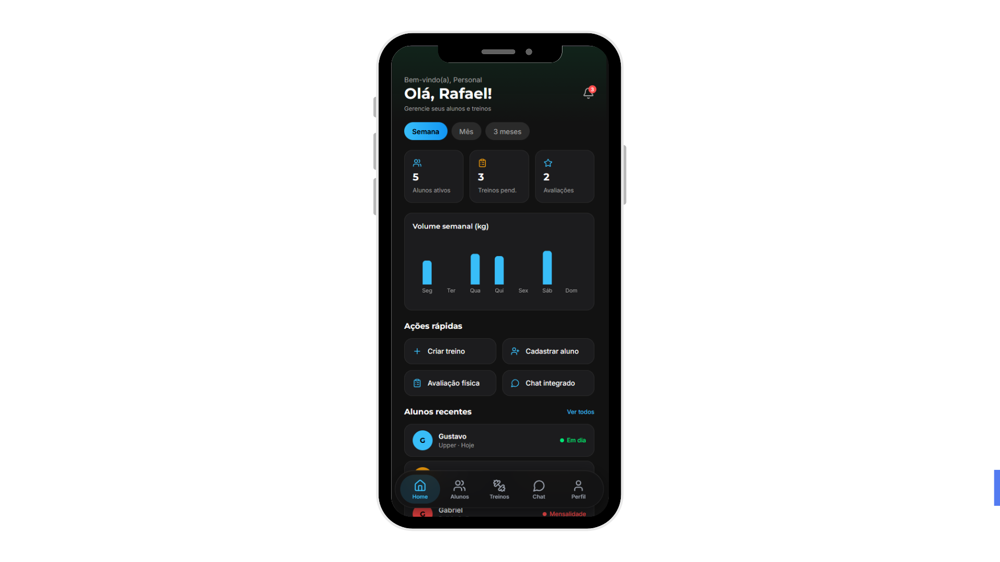

---

### Histórias vinculadas

#### H02 — Dashboard centralizado de alunos

> *Como personal, desejo visualizar em um painel centralizado o status e progresso dos meus alunos, para tomar decisões rápidas sem navegar por múltiplas telas.*

**Implementação no MVP:**
A tela T05 é a implementação direta do dashboard centralizado. Os cards de indicadores, o gráfico de volume semanal com filtros de período e a lista de alunos recentes fornecem ao Personal a visão consolidada prevista em H02.

---

#### H06 — Interface visual de status dos alunos

> *Como personal, desejo visualizar o status de cada aluno de forma visual e intuitiva, para identificar rapidamente quem precisa de atenção.*

**Implementação no MVP:**
A lista de alunos recentes em T05 apresenta os alunos com status visual resumido. As ações rápidas (Criar treino, Cadastrar aluno, Avaliação física, Chat) complementam o acesso rápido previsto em H06.

---

#### H09 — Alertas de faltas do aluno

> *Como personal, desejo receber alertas quando um aluno faltar consecutivamente, para agir preventivamente e manter o engajamento.*

**Implementação no MVP:**
O ícone de notificações na barra superior da tela T05 dá acesso centralizado aos alertas do sistema, incluindo alertas de faltas. O card de treinos pendentes nos indicadores também sinaliza visualmente situações que demandam atenção.

---

#### H12 — Lembretes de treino para o personal

> *Como personal, desejo receber lembretes de treinos agendados com meus alunos, para me organizar melhor e não perder compromissos.*

**Implementação no MVP:**
O acesso às notificações via ícone no topo da tela T05 inclui os lembretes de treino configurados para o Personal, mantendo os compromissos do dia acessíveis diretamente do dashboard principal.

<p align="right"><a href="#-sumário">⬆️ Voltar ao sumário</a></p>

---

<a id="t06--dashboard-do-aluno"></a>
## T06 — Dashboard do Aluno

> **Perfil:** Aluno · **Cor predominante:** Verde
> **Descrição:** Tela inicial interna do Aluno. Saudação personalizada, indicadores (treinos, sequência, metas), gráfico de progresso semanal, ações rápidas e lista de treinos disponíveis.

###  Print da tela
> 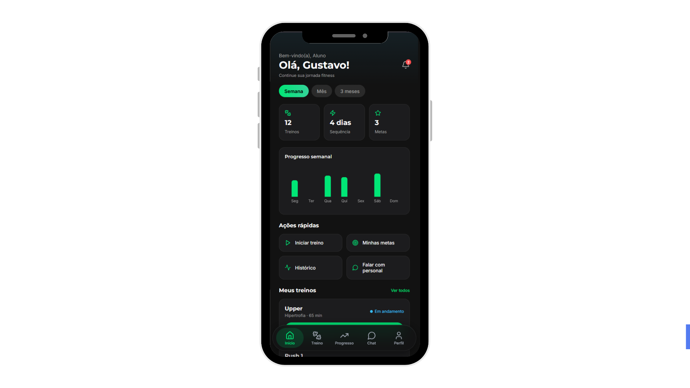
---

### Histórias vinculadas

#### H24 — Ficha personalizada do dia

> *Como aluno, desejo visualizar a ficha de treino personalizada do dia, para saber exatamente o que devo executar sem precisar consultar o personal.*

**Implementação no MVP:**
A lista de treinos disponíveis na parte inferior da tela T06 apresenta as rotinas do aluno com nome, objetivo, status e quantidade de exercícios. A ação rápida `Iniciar treino` dá acesso imediato à ficha do dia, atendendo ao objetivo central de H24.

---

#### H25 — Lembretes de treino para o aluno

> *Como aluno, desejo receber lembretes automáticos sobre meus treinos, para manter a consistência na rotina.*

**Implementação no MVP:**
O ícone de notificações no topo da tela T06 concentra os lembretes automáticos de treino configurados pelo sistema ou pelo personal, mantendo o aluno informado diretamente do seu dashboard.

---

#### H22 — Relatório semanal ou mensal de desempenho

> *Como aluno, desejo visualizar um relatório do meu desempenho semanal ou mensal, para entender minha evolução ao longo do tempo.*

**Implementação no MVP:**
O gráfico de progresso semanal presente em T06, com filtros de período (Semana, Mês, 3 meses), fornece ao aluno a visão resumida de evolução prevista em H22. Os cards de indicadores (Treinos, Sequência, Metas) complementam o relatório visual de desempenho.

<p align="right"><a href="#-sumário">⬆️ Voltar ao sumário</a></p>

---

<a id="t07--progresso-do-aluno"></a>
## T07 — Progresso do Aluno

> **Perfil:** Aluno · **Cor predominante:** Verde
> **Descrição:** Acompanhamento de evolução física. Exibe peso atual, último registro, frequência, volume total, gráfico de evolução e formulário para registrar novas medidas corporais.

###  Print da tela
> 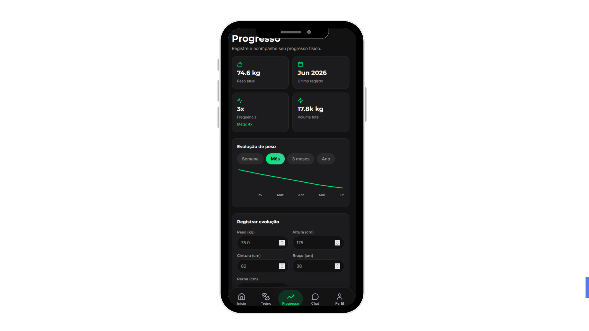

---

### Histórias vinculadas

#### H13 — Gráficos de evolução física

> *Como aluno, desejo visualizar gráficos da minha evolução física ao longo do tempo, para acompanhar meu progresso de forma visual.*

**Implementação no MVP:**
O gráfico de evolução de peso com filtros de período (Semana, Mês, 3 meses, Ano) implementa diretamente o requisito de H13. Os cards de peso atual, frequência e volume total enriquecem a visualização prevista na história.

---

#### H23 — Gráficos de progresso da aluna

> *Como aluna, desejo visualizar gráficos do meu progresso físico com medidas corporais, para acompanhar a evolução das minhas medidas ao longo do tempo.*

**Implementação no MVP:**
O formulário de registro em T07 — com campos de peso, altura, cintura, braço, perna e observações — implementa o registro das medidas corporais previsto em H23. O gráfico exibe a evolução dessas medidas ao longo do período selecionado.

---

#### H22 — Relatório semanal ou mensal de desempenho

> *Como aluno, desejo visualizar um relatório do meu desempenho semanal ou mensal, para entender minha evolução ao longo do tempo.*

**Implementação no MVP:**
Os filtros de período e o gráfico de evolução em T07 complementam o relatório de desempenho iniciado no dashboard (T06), oferecendo uma visão mais detalhada por medida específica, conforme previsto em H22.

<p align="right"><a href="#-sumário">⬆️ Voltar ao sumário</a></p>

---

<a id="t08--notificações"></a>
## T08 — Notificações

> **Perfil:** Aluno (predominante) · **Cor predominante:** Verde
> **Descrição:** Central de notificações com filtros por categoria (Todas, Não lidas, Treinos, Financeiro), contador de não lidas e ação para marcar como lida.

###  Print da tela
> 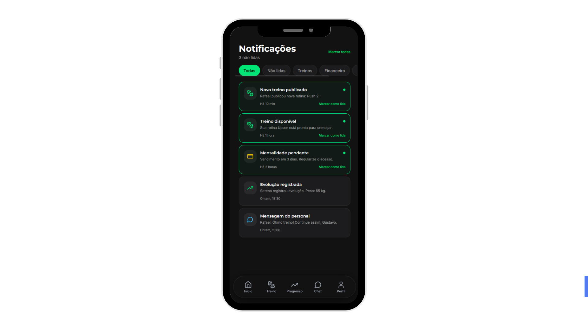
---

### Histórias vinculadas

#### H09 — Alertas de faltas do aluno

> *Como personal, desejo receber alertas quando um aluno faltar consecutivamente, para agir preventivamente e manter o engajamento.*

**Implementação no MVP:**
A tela T08 centraliza todos os alertas do sistema. O filtro `Treinos` agrupa os alertas relacionados à frequência dos alunos, incluindo notificações de faltas consecutivas previstas em H09.

---

#### H12 — Lembretes de treino para o personal

> *Como personal, desejo receber lembretes de treinos agendados com meus alunos, para me organizar melhor e não perder compromissos.*

**Implementação no MVP:**
Os lembretes de treino chegam ao Personal via T08. O filtro `Treinos` permite visualizar especificamente esses lembretes sem misturá-los com outras categorias de notificação.

---

#### H25 — Lembretes de treino para o aluno

> *Como aluno, desejo receber lembretes automáticos sobre meus treinos, para manter a consistência na rotina.*

**Implementação no MVP:**
Os lembretes automáticos de treino chegam ao aluno via T08. As notificações não lidas têm destaque visual (borda verde e indicador), garantindo que o aluno perceba os lembretes pendentes conforme previsto em H25.

<p align="right"><a href="#-sumário">⬆️ Voltar ao sumário</a></p>

---

<a id="t09--perfil-do-aluno"></a>
## T09 — Perfil do Aluno

> **Perfil:** Aluno / AA · **Cor predominante:** Verde
> **Descrição:** Tela de perfil com informações pessoais, métricas resumidas (Treinos, Sequência, Metas), gráfico dos últimos 6 meses, preferências de notificações e seção de acessibilidade.

###  Print da tela
> 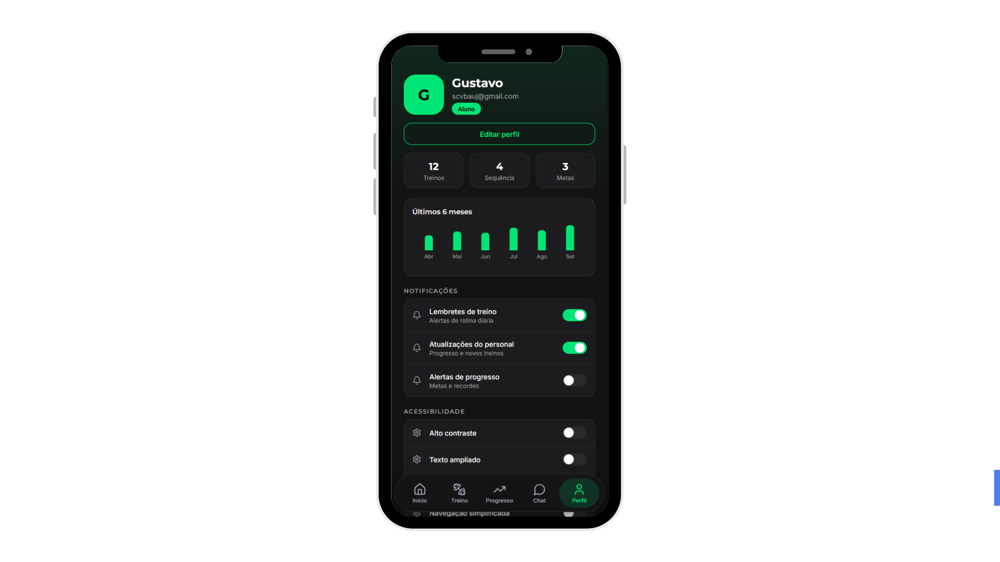

---

### Histórias vinculadas

#### H17 — Alto contraste e fontes escaláveis

> *Como aluno com acessibilidade, desejo ativar alto contraste e ajustar o tamanho das fontes, para melhorar minha legibilidade dentro do aplicativo.*

**Implementação no MVP:**
A seção de acessibilidade em T09 expõe os toggles de Alto contraste, Texto ampliado e Navegação simplificada diretamente na tela de perfil, garantindo que o aluno com baixa visão consiga ativar os recursos sem acessar menus externos, atendendo ao critério central de H17.

<p align="right"><a href="#-sumário">⬆️ Voltar ao sumário</a></p>

---

<a id="t10--chat-integrado"></a>
## T10 — Chat Integrado

> **Perfil:** Aluno e Personal Trainer · **Cor predominante:** Verde/Azul
> **Descrição:** Tela de conversa entre aluno e personal. Mensagens em bolhas com diferenciação visual por remetente, campo de texto e botão de envio.

###  Print da tela
> 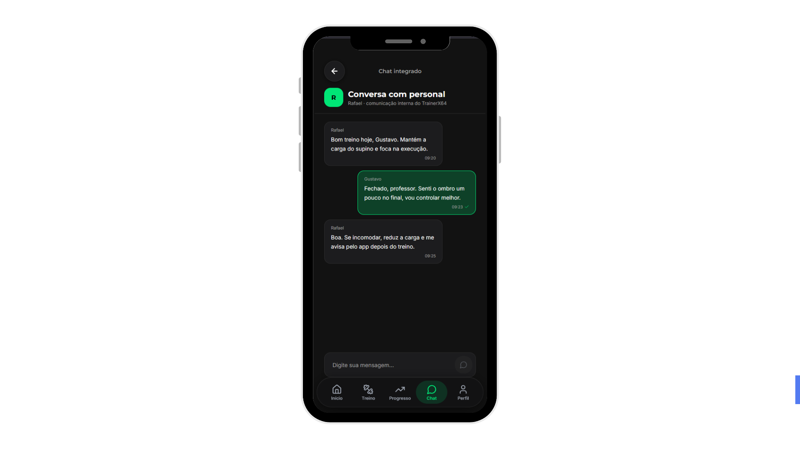
> ```

---

### Histórias vinculadas

#### H05 — Chat direto entre personal e aluno

> *Como personal, desejo me comunicar diretamente com os alunos por um chat integrado, para enviar feedbacks e orientações sem depender de aplicativos externos.*

**Implementação no MVP:**
A tela T10 implementa o canal de comunicação direta entre personal e aluno dentro do próprio aplicativo. Mensagens do usuário ativo aparecem destacadas em verde, mensagens recebidas em card escuro neutro. O campo de digitação e botão de envio completam o fluxo de comunicação interna previsto em H05.

<p align="right"><a href="#-sumário">⬆️ Voltar ao sumário</a></p>

---

<a id="t11--treinos-do-aluno"></a>
## T11 — Treinos do Aluno

> **Perfil:** Aluno · **Cor predominante:** Verde
> **Descrição:** Listagem de rotinas disponíveis. Botão de treinamento livre, busca, filtros por categoria (Hipertrofia, Emagrecimento, Condicionamento) e cards das rotinas com status e botão de iniciar.

### Print da tela
> 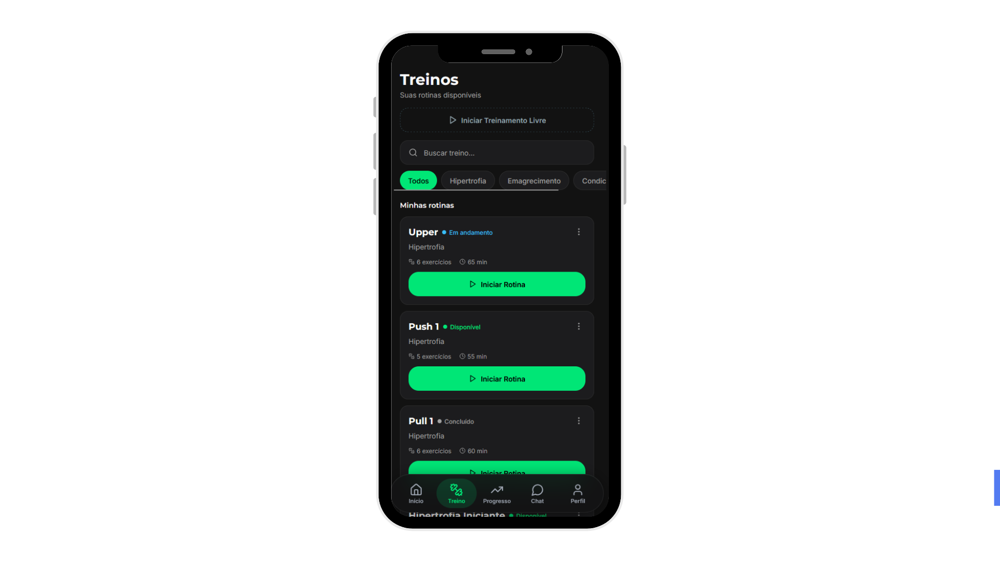

---

### Histórias vinculadas

#### H24 — Ficha personalizada do dia

> *Como aluno, desejo visualizar a ficha de treino personalizada do dia, para saber exatamente o que devo executar sem precisar consultar o personal.*

**Implementação no MVP:**
A lista de rotinas em T11 exibe os treinos atribuídos pelo personal com nome, objetivo, status e duração. O botão `Iniciar Rotina` dá acesso à execução imediata da ficha do dia, atendendo diretamente ao objetivo de H24.

---

#### H10 — Vídeos explicativos dos exercícios

> *Como aluno, desejo assistir a vídeos explicativos de cada exercício, para executar os movimentos corretamente e com segurança.*

**Implementação no MVP:**
Os cards de treino em T11 funcionam como ponto de entrada para o detalhe de cada exercício, onde os vídeos demonstrativos estão disponíveis. A estrutura da tela prepara o fluxo de navegação exercício → vídeo previsto em H10.

---

#### H11 — Registro de cargas e repetições

> *Como aluno, desejo registrar as cargas e repetições realizadas em cada exercício, para acompanhar minha evolução e ajustar os treinos.*

**Implementação no MVP:**
Ao iniciar uma rotina a partir de T11, o aluno acessa o registro de execução de cada exercício com campos de carga e repetições. A tela T11 é o ponto de partida desse fluxo de registro previsto em H11.

<p align="right"><a href="#-sumário">⬆️ Voltar ao sumário</a></p>

---

<a id="t12--perfil--alto-contraste-ativado"></a>
## T12 — Perfil — Alto Contraste Ativado

> **Perfil:** Aluno com Acessibilidade (AA) · **Cor predominante:** Verde/Contraste
> **Descrição:** Variação da tela de perfil (T09) com alto contraste ativo. Fundo mais escuro, elementos verdes com maior destaque visual. Toggle de alto contraste em estado ligado.

###  Print da tela


> 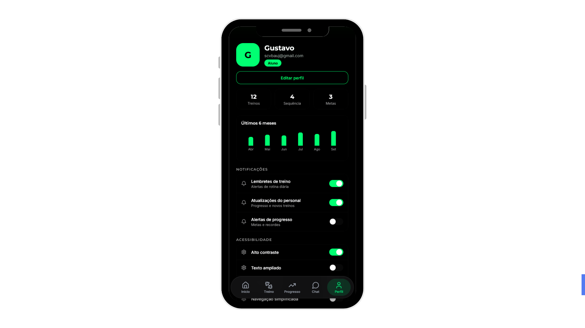


---

### Histórias vinculadas

#### H17 — Alto contraste e fontes escaláveis

> *Como aluno com acessibilidade, desejo ativar alto contraste e ajustar o tamanho das fontes, para melhorar minha legibilidade dentro do aplicativo.*

**Implementação no MVP:**
A tela T12 demonstra visualmente o resultado da ativação do alto contraste configurado em T09. O sistema adapta toda a interface — fundo, tipografia e elementos visuais — ao modo de maior contraste, validando o comportamento esperado em H17.

---

#### H16 — Suporte a leitores de tela

> *Como aluno com acessibilidade, desejo que o aplicativo seja compatível com leitores de tela, para navegar e interagir com autonomia.*

**Implementação no MVP:**
A tela T12 representa o estado do aplicativo configurado para acessibilidade máxima. O modo alto contraste ativado, combinado com o suporte a leitores de tela configurado desde o cadastro (T02), demonstra a camada de acessibilidade integrada prevista em H16.

<p align="right"><a href="#-sumário">⬆️ Voltar ao sumário</a></p>

---

<a id="t13--meus-alunos"></a>
## T13 — Meus Alunos

> **Perfil:** Personal Trainer · **Cor predominante:** Azul/Ciano
> **Descrição:** Lista de alunos cadastrados com busca, filtros por status (Em dia, Pendente, Mensalidade) e informações resumidas de cada aluno (nome, treino, último acesso, status).

###  Print da tela


> 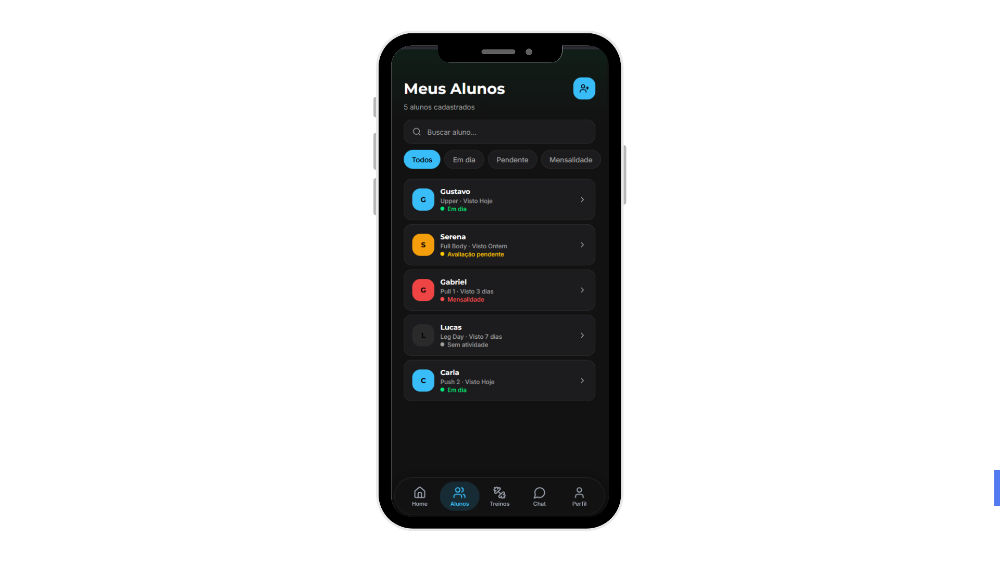

---

### Histórias vinculadas

#### H06 — Interface visual de status dos alunos

> *Como personal, desejo visualizar o status de cada aluno de forma visual e intuitiva, para identificar rapidamente quem precisa de atenção.*

**Implementação no MVP:**
A tela T13 implementa diretamente H06. Cada card de aluno exibe nome, treino associado, último acesso e status com diferenciação visual. Os filtros por status (Em dia, Pendente, Mensalidade) permitem identificação imediata de quem precisa de atenção.

---

#### H21 — Cadastro de novo aluno

> *Como personal, desejo cadastrar novos alunos no sistema, para começar a gerenciar seus treinos e evolução.*

**Implementação no MVP:**
O botão de adicionar aluno (`+`) em T13 inicia o fluxo de cadastro de novo aluno. A lista atualiza-se após o cadastro, exibindo o novo aluno com status inicial ativo conforme definido em H21.

---

#### H26 — Lista de alunos com mensalidade pendente

> *Como personal, desejo visualizar quais alunos estão com mensalidade pendente, para gerenciar cobranças e receber os pagamentos devidos.*

**Implementação no MVP:**
O filtro `Mensalidade` em T13 lista exclusivamente os alunos com situação financeira pendente, atendendo ao critério central de H26. A informação de status financeiro é exibida diretamente no card de cada aluno.

---

#### H27 — Marcação de mensalidade como recebida

> *Como personal, desejo marcar uma mensalidade como recebida, para manter o controle financeiro atualizado sem sistemas externos.*

**Implementação no MVP:**
O acesso ao detalhe do aluno a partir de T13 inclui a ação de marcar mensalidade como recebida, atualizando o status financeiro na lista e retirando o aluno do filtro de pendências, conforme previsto em H27.

<p align="right"><a href="#-sumário">⬆️ Voltar ao sumário</a></p>

---

<a id="t14--treinos-do-personal-trainer"></a>
## T14 — Treinos do Personal Trainer

> **Perfil:** Personal Trainer · **Cor predominante:** Azul/Ciano
> **Descrição:** Gerenciamento de rotinas e modelos de treino. Botões de Nova Rotina e Explorar, busca, filtros por categoria e cards de treinos com opção de atribuição a alunos.

###  Print da tela

> 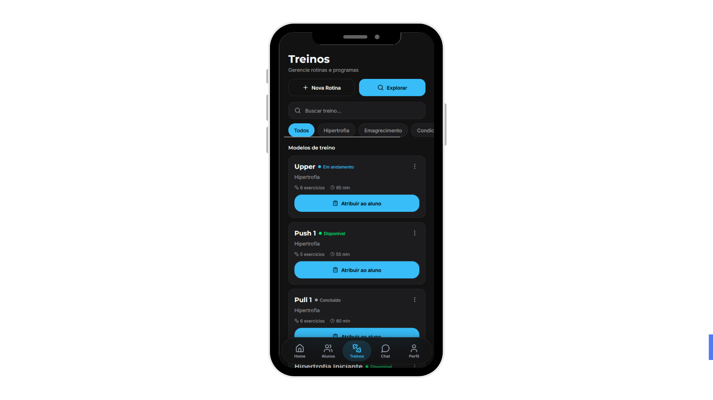

---

### Histórias vinculadas

#### H01 — Cadastro de treinos padronizados

> *Como personal, desejo cadastrar treinos padronizados para replicá-los rapidamente entre alunos com objetivos similares.*

**Implementação no MVP:**
A tela T14 exibe a lista de modelos de treino criados pelo personal. O botão `Nova Rotina` inicia a criação de um novo template. O botão `Atribuir ao aluno` permite replicar o template, implementando o fluxo central de H01.

---

#### H03 — Relatórios automáticos de evolução

> *Como personal, desejo gerar relatórios automáticos de evolução dos alunos, para apresentar resultados de forma profissional sem planilhas externas.*

**Implementação no MVP:**
Os filtros de período disponíveis em T14 permitem ao Personal visualizar o histórico de treinos atribuídos por período, servindo como base para a geração dos relatórios de evolução previstos em H03.

<p align="right"><a href="#-sumário">⬆️ Voltar ao sumário</a></p>

---

<a id="t15--criar-treino"></a>
## T15 — Criar Treino

> **Perfil:** Personal Trainer · **Cor predominante:** Azul/Ciano
> **Descrição:** Formulário de criação de treino. Seleção opcional de aluno, nome, categoria, descrição, lista de exercícios e botão `Salvar treino` — desabilitado enquanto campos obrigatórios não forem preenchidos.

### Print da tela


> 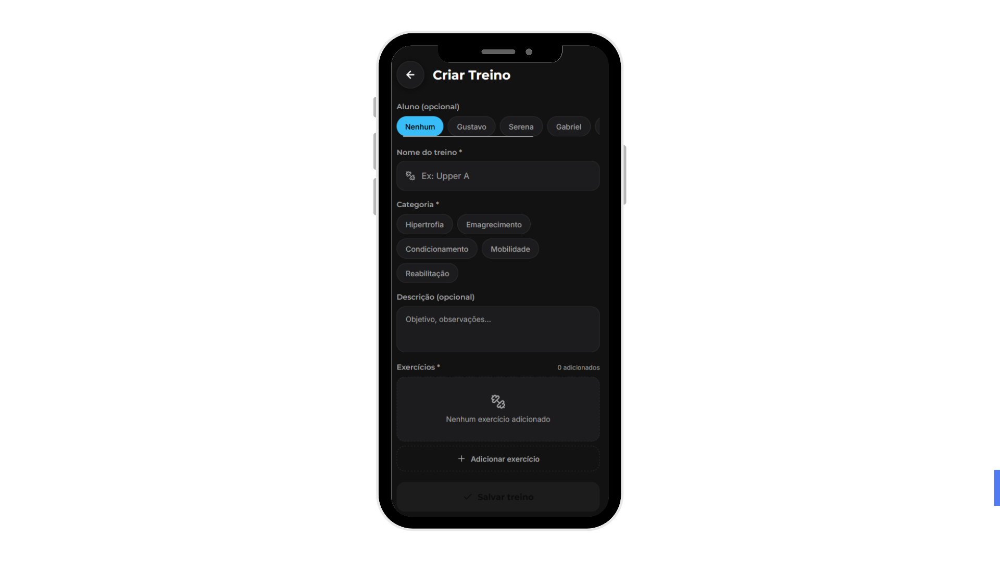

---

### Histórias vinculadas

#### H01 — Cadastro de treinos padronizados

> *Como personal, desejo cadastrar treinos padronizados para replicá-los rapidamente entre alunos com objetivos similares.*

**Implementação no MVP:**
A tela T15 é a implementação direta do cadastro de treino previsto em H01. Os campos de nome, categoria e exercícios correspondem exatamente aos requisitos da história. O botão `Salvar treino` permanece desabilitado enquanto não houver ao menos um exercício adicionado, atendendo à regra de negócio `H01-RN01`.

---

#### H21 — Cadastro de novo aluno

> *Como personal, desejo cadastrar novos alunos no sistema, para começar a gerenciar seus treinos e evolução.*

**Implementação no MVP:**
A lista de seleção de aluno disponível em T15 reflete os alunos previamente cadastrados via H21. A criação de um treino já vinculado a um aluno específico fecha o fluxo de onboarding iniciado em T13.

<p align="right"><a href="#-sumário">⬆️ Voltar ao sumário</a></p>

---

## Matriz de Rastreabilidade Consolidada

| História | Enunciado resumido | Telas vinculadas |
|---|---|:---:|
| H01 | Cadastro de treinos padronizados | T14, T15 |
| H02 | Dashboard centralizado de alunos | T05 |
| H03 | Relatórios automáticos de evolução | T14 |
| H05 | Chat direto entre personal e aluno | T10 |
| H06 | Interface visual de status dos alunos | T05, T13 |
| H07 | Fluxo de primeiros passos | T02 |
| H09 | Alertas de faltas do aluno | T05, T08 |
| H10 | Vídeos explicativos dos exercícios | T11 |
| H11 | Registro de cargas e repetições | T11 |
| H12 | Lembretes de treino para o personal | T05, T08 |
| H13 | Gráficos de evolução física | T07 |
| H16 | Suporte a leitores de tela | T02, T12 |
| H17 | Alto contraste e fontes escaláveis | T02, T09, T12 |
| H21 | Cadastro de novo aluno | T13, T15 |
| H22 | Relatório semanal ou mensal de desempenho | T06, T07 |
| H23 | Gráficos de progresso da aluna | T07 |
| H24 | Ficha personalizada do dia | T06, T11 |
| H25 | Lembretes de treino para o aluno | T06, T08 |
| H26 | Lista de alunos com mensalidade pendente | T13 |
| H27 | Marcação de mensalidade como recebida | T13 |
| H28 | Login com e-mail e senha | T01, T03, T04 |
| H29 | Recuperação de senha por e-mail | T03, T04 |

---
